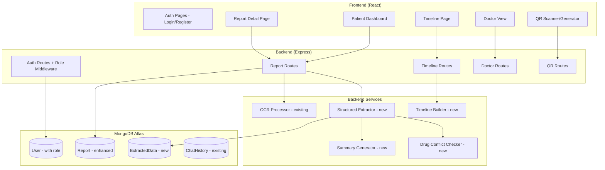
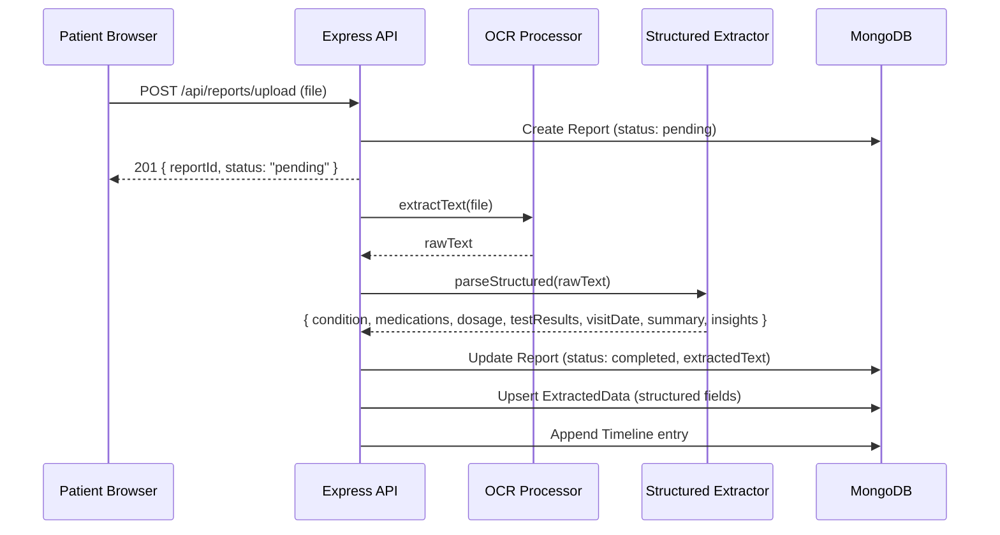
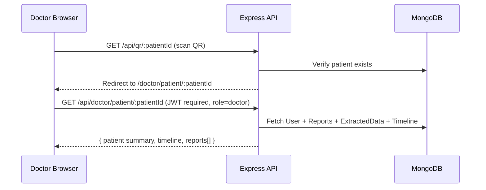

# Design Document: Medical Report Management (MedExplain Upgrade)

## Overview

This document describes the comprehensive upgrade of the MedExplain MERN application from a basic OCR report viewer into a full medical report management platform. The upgrade introduces structured AI-assisted data extraction, role-based access (patient/doctor), a chronological health timeline, QR-based patient sharing, and a professional hospital-grade UI — all without AI buzzwords.

The existing backend (Node.js/Express, MongoDB, Tesseract.js OCR, pdf-parse, JWT auth) and frontend (React, Bootstrap 5, react-i18next) are preserved and extended rather than replaced.

---

## Architecture



---

## Sequence Diagrams

### Report Upload & Processing Flow



### Doctor Access via QR Flow



---

## Components and Interfaces

### Component 1: Auth Module (Enhanced)

**Purpose**: Extend existing JWT auth to support `role` field (patient/doctor).

**Interface**:
```typescript
interface RegisterPayload {
  name: string
  email: string
  password: string
  role: 'patient' | 'doctor'
}

interface AuthToken {
  id: string
  role: 'patient' | 'doctor'
  iat: number
  exp: number
}
```

**Responsibilities**:
- Add `role` field to User schema (default: `'patient'`)
- Include `role` in JWT payload
- `requireRole(role)` middleware for route-level access control

---

### Component 2: Structured Extractor Service (New)

**Purpose**: Parse raw OCR/PDF text into structured medical fields using regex + keyword heuristics. No external AI API — runs locally.

**Interface**:
```typescript
interface ExtractedData {
  reportId: ObjectId
  userId: ObjectId
  condition: string          // e.g. "Hypertension", "Type 2 Diabetes"
  medications: string[]      // e.g. ["Metformin", "Amlodipine"]
  dosage: string[]           // e.g. ["500mg twice daily", "5mg once daily"]
  testResults: TestResult[]
  visitDate: Date | null
  summary: string            // 3-4 line neutral summary
  insights: Insight[]        // soft warnings, not alerts
  rawText: string
  createdAt: Date
}

interface TestResult {
  parameter: string
  value: string
  unit: string
  referenceRange: string
  isAbnormal: boolean
}

interface Insight {
  type: 'duplicate_medication' | 'dosage_note' | 'followup_suggested'
  message: string            // neutral language, e.g. "Metformin appears in 2 reports"
}
```

**Responsibilities**:
- Extract condition from diagnosis/impression sections
- Extract medication names and dosages via regex patterns
- Detect duplicate medications across a patient's reports
- Generate a 3-4 sentence neutral summary from key findings
- Produce soft `Insight` notes (not clinical alerts)

---

### Component 3: Timeline Builder Service (New)

**Purpose**: Aggregate a patient's ExtractedData records into a chronological timeline.

**Interface**:
```typescript
interface TimelineEntry {
  date: Date
  condition: string
  medications: string[]
  summary: string
  reportId: ObjectId
}
```

**Responsibilities**:
- Query all ExtractedData for a userId, sorted by visitDate
- Return ordered array of TimelineEntry objects
- Used by both patient Timeline page and Doctor View

---

### Component 4: QR Code Module (New)

**Purpose**: Generate a per-patient QR code encoding a URL to their shared history, and validate QR-based access.

**Interface**:
```typescript
interface QRPayload {
  patientId: string          // MongoDB ObjectId as string
  generatedAt: Date
}
```

**Responsibilities**:
- Backend: `GET /api/qr/:patientId` — generate QR image (base64 PNG) using `qrcode` npm package
- Frontend: Display QR in patient profile; provide scan entry point for doctors
- QR encodes URL: `{APP_URL}/doctor/patient/:patientId`

---

### Component 5: Doctor View (New)

**Purpose**: Read-only interface for doctors to view a patient's full history.

**Interface**:
```typescript
interface DoctorPatientView {
  patient: { name: string; email: string }
  timeline: TimelineEntry[]
  reports: ReportSummary[]
}
```

**Responsibilities**:
- Search patient by ID or scan QR
- Display summary, timeline, and all reports (read-only)
- Requires JWT with `role: 'doctor'`

---

## Data Models

### User (Enhanced)

```javascript
{
  name: String,
  email: String (unique),
  password: String (hashed),
  role: { type: String, enum: ['patient', 'doctor'], default: 'patient' },
  language: { type: String, default: 'en' },
  patientId: String,   // short unique ID for QR/search, e.g. "MED-00042"
  createdAt: Date
}
```

**Validation Rules**:
- `role` must be `'patient'` or `'doctor'`
- `patientId` auto-generated on patient registration

---

### Report (Enhanced)

```javascript
{
  userId: ObjectId (ref: User),
  fileName: String,
  originalName: String,       // human-readable original filename
  fileType: { enum: ['pdf', 'image'] },
  uploadDate: Date,
  extractedText: String,      // raw OCR/PDF text (existing)
  status: { enum: ['pending', 'processing', 'completed', 'failed'] },
  processedAt: Date,
  analysisError: String
  // simplified/analysis fields removed — moved to ExtractedData
}
```

---

### ExtractedData (New)

```javascript
{
  reportId: ObjectId (ref: Report),
  userId: ObjectId (ref: User),
  condition: String,
  medications: [String],
  dosage: [String],
  testResults: [{
    parameter: String,
    value: String,
    unit: String,
    referenceRange: String,
    isAbnormal: Boolean
  }],
  visitDate: Date,
  summary: String,
  insights: [{
    type: String,
    message: String
  }],
  createdAt: Date
}
```

---

## Key Algorithms

### Structured Extraction Algorithm

```pascal
PROCEDURE parseStructured(rawText)
  INPUT: rawText (String from OCR or PDF)
  OUTPUT: ExtractedData object

  SEQUENCE
    condition    ← extractCondition(rawText)
    medications  ← extractMedications(rawText)
    dosage       ← extractDosage(rawText)
    testResults  ← extractTestResults(rawText)   // reuse existing patterns
    visitDate    ← extractVisitDate(rawText)
    summary      ← buildSummary(condition, testResults, medications)
    insights     ← generateInsights(medications, userId)

    RETURN { condition, medications, dosage, testResults, visitDate, summary, insights }
  END SEQUENCE
END PROCEDURE

PROCEDURE extractCondition(text)
  // Look for diagnosis/impression/assessment sections
  FOR each pattern IN [/diagnosis[:\s]+([^\n]+)/i, /impression[:\s]+([^\n]+)/i,
                       /assessment[:\s]+([^\n]+)/i, /condition[:\s]+([^\n]+)/i]
    match ← regex.exec(text)
    IF match THEN RETURN capitalize(match[1].trim())
  END FOR
  RETURN "General Checkup"
END PROCEDURE

PROCEDURE buildSummary(condition, testResults, medications)
  // Compose 3-4 neutral sentences
  lines ← []
  lines.push("Visit recorded for: " + condition + ".")
  
  abnormal ← testResults.filter(r => r.isAbnormal)
  IF abnormal.length > 0 THEN
    lines.push(abnormal.length + " test value(s) noted outside reference range.")
  END IF
  
  IF medications.length > 0 THEN
    lines.push("Medications noted: " + medications.join(", ") + ".")
  END IF
  
  lines.push("Review detailed results below for full context.")
  RETURN lines.join(" ")
END PROCEDURE

PROCEDURE generateInsights(medications, userId)
  insights ← []
  
  // Check for duplicate medications across patient's history
  pastMeds ← ExtractedData.find({ userId }).select('medications')
  allPastMeds ← flatten(pastMeds.map(d => d.medications))
  
  FOR each med IN medications
    IF allPastMeds.includes(med.toLowerCase()) THEN
      insights.push({
        type: 'duplicate_medication',
        message: med + " has appeared in a previous report."
      })
    END IF
  END FOR
  
  RETURN insights
END PROCEDURE
```

---

## Error Handling

### Scenario 1: OCR Extraction Fails

**Condition**: Tesseract times out or returns empty text for an image.
**Response**: Report status set to `'failed'`; `analysisError` field populated.
**Recovery**: User sees "Processing failed" badge on report card with option to re-upload.

### Scenario 2: Unauthorized Doctor Access

**Condition**: Request to `/api/doctor/*` without `role: 'doctor'` in JWT.
**Response**: `403 Forbidden` — `{ error: "Access restricted to doctors" }`.
**Recovery**: Frontend redirects to patient dashboard.

### Scenario 3: Patient Not Found (QR Scan)

**Condition**: QR encodes a patientId that no longer exists.
**Response**: `404 Not Found` — `{ error: "Patient record not found" }`.
**Recovery**: Doctor sees a "Record not found" page with a search fallback.

### Scenario 4: Duplicate File Upload

**Condition**: Same file uploaded twice (detected by filename + userId).
**Response**: `409 Conflict` — `{ error: "This report has already been uploaded" }`.
**Recovery**: Frontend shows inline warning, does not create duplicate record.

---

## Testing Strategy

### Unit Testing Approach

Test each service function in isolation:
- `extractCondition(text)` — various diagnosis section formats
- `buildSummary(...)` — correct sentence count and neutral language
- `generateInsights(...)` — duplicate detection logic
- `requireRole(role)` middleware — correct 403 on role mismatch

### Property-Based Testing Approach

**Property Test Library**: fast-check (JavaScript)

Key properties:
- For any `rawText`, `parseStructured(rawText)` always returns an object with all required fields (never throws)
- For any `medications` array, `generateInsights` never returns insights with empty `message`
- `buildSummary` always returns a string of 3–4 sentences regardless of input completeness

### Integration Testing Approach

- Full upload → OCR → extraction → DB write flow using a sample PDF fixture
- Doctor route returns 403 for patient-role JWT
- QR endpoint returns valid base64 PNG for existing patientId

---

## Performance Considerations

- OCR (Tesseract) is CPU-intensive; keep async fire-and-forget pattern (already in place) so upload response is immediate
- Timeline queries use compound index on `{ userId: 1, visitDate: -1 }` for fast chronological retrieval
- QR images are generated on-demand and not stored (stateless generation via `qrcode` package)
- Report file serving uses `express.static` on the `uploads/` directory with cache headers

---

## Security Considerations

- JWT includes `role` claim; all doctor routes validate via `requireRole('doctor')` middleware
- Patients can only access their own reports (userId check on every report query — already in place)
- Uploaded files are stored with randomized filenames (Multer `diskStorage` with `Date.now()` prefix) to prevent path traversal
- QR URL encodes only the patientId (MongoDB ObjectId) — no sensitive data in QR payload
- Doctor search by patientId returns only non-sensitive summary fields (name, timeline, report summaries) — no raw text or file paths

---

## Dependencies

### New Backend Dependencies

| Package | Purpose |
|---|---|
| `qrcode` | Generate QR code PNG from patient URL |

### New Frontend Dependencies

| Package | Purpose |
|---|---|
| `qrcode.react` | Render QR code as SVG/canvas in React |
| `react-pdf` | Render PDF files inline in Report Detail split view |

### Existing Dependencies (Retained)

- `tesseract.js`, `pdf-parse` — OCR and PDF text extraction
- `multer` — file upload handling
- `jsonwebtoken`, `bcryptjs` — auth
- `mongoose` — MongoDB ODM
- `react-router-dom`, `react-bootstrap`, `react-i18next` — frontend routing, UI, i18n

---

## UI Design Tokens

```css
/* Color palette — hospital-grade minimal */
--color-bg:         #f8f9fa;   /* light grey page background */
--color-surface:    #ffffff;   /* card/panel background */
--color-border:     #e9ecef;   /* subtle borders */
--color-accent:     #4a90a4;   /* soft blue-green primary */
--color-accent-lt:  #e8f4f8;   /* accent tint for badges/highlights */
--color-text:       #2d3748;   /* dark grey body text */
--color-text-muted: #718096;   /* secondary text */
--color-warning:    #d69e2e;   /* soft amber for insights (not red) */
--color-success:    #38a169;   /* normal value indicator */

/* Typography */
--font-family: 'Inter', 'Roboto', sans-serif;

/* Spacing & Shape */
--radius-card: 12px;
--shadow-card: 0 2px 8px rgba(0,0,0,0.08);
--transition: 0.2s ease;
```

---

## Page Layout Specifications

### 1. Patient Dashboard

- Header: patient name, avatar initials, logout button (right-aligned)
- Primary action: "Upload Report" button (accent color, top-right of content area)
- Report grid: cards showing `uploadDate`, `condition`, status badge, "View Details" button
- Empty state: illustration + "Upload your first report to get started"

### 2. Report Detail Page (Split Layout)

- Left panel (40%): original file preview — PDF via `react-pdf`, image via ``
- Right panel (60%): tabbed sections
  - "Summary" tab: 3-4 line neutral summary text
  - "Details" tab: Condition, Medications, Dosage, Test Results table
  - "Notes" tab: Insight cards (amber border, neutral language)

### 3. Medical Timeline Page

- Vertical timeline component (CSS-only, no heavy library)
- Each entry: date pill (left), condition + treatment summary (right), "View Report" link
- Sorted newest-first by default; toggle to oldest-first

### 4. Doctor View

- Search bar: enter patientId (e.g. "MED-00042") or click "Scan QR"
- Results: patient name, summary card, timeline, collapsible report list
- Read-only — no upload, delete, or edit controls visible

### 5. QR Code Page (Patient)

- Displays generated QR code (200×200px)
- Label: "Share with your doctor"
- Copy link button below QR
- Note: "Your doctor can scan this to view your medical history"
